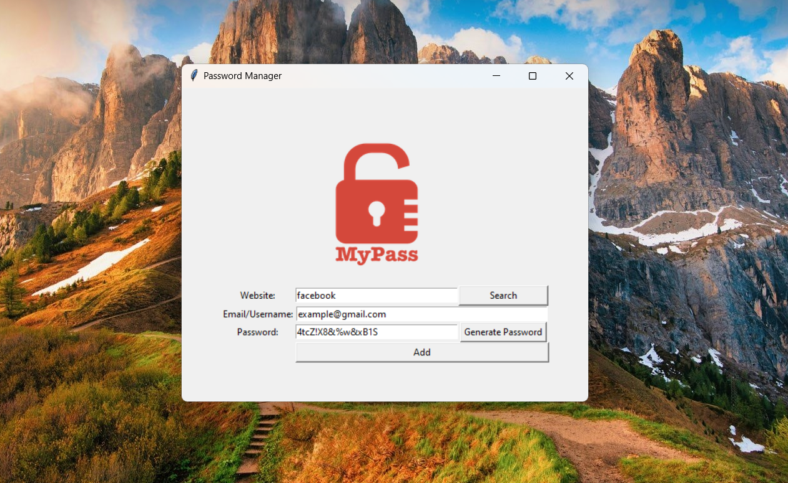
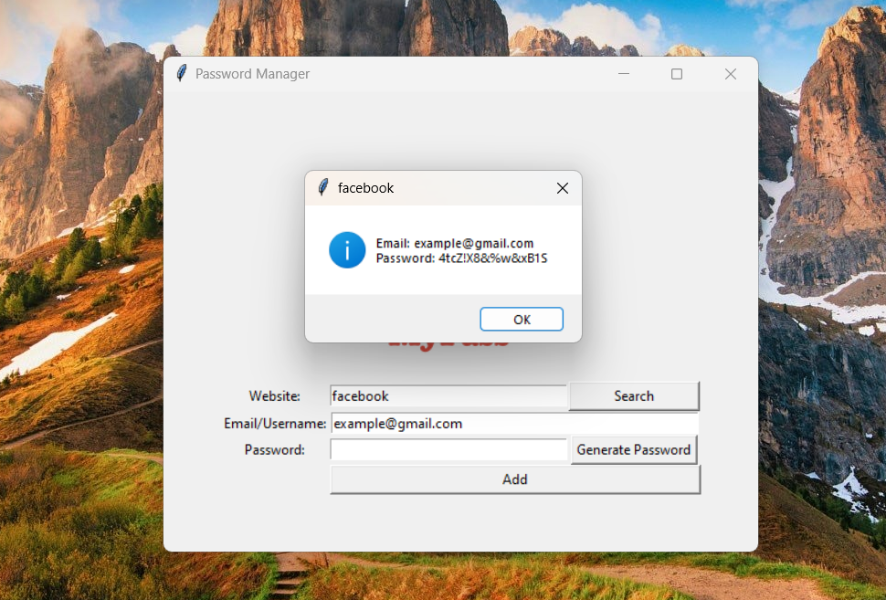

### This project is a password manager that generates secure passwords and stores them with associated website and email/username information. It also allows searching for stored passwords.

## Features

- **Secure Password Generation:** Generates random passwords with letters, numbers, and symbols.
- **Password Storage:** Saves password information in a `data.json` file.
- **Password Search:** Allows you to search for stored passwords by website.

## Program Running Screenshots
### Adding a new password

### Searching for a password

